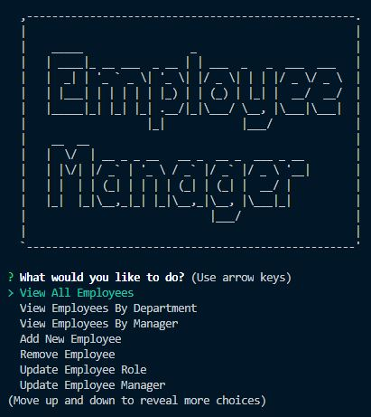

# employeeTracker

## Description

Command line application that allows manager to add, delete, or update job functions. Department, roles, and employees are all mutable with this application and stored into a database.

## Table of Contents

- [Installation](#installation)

- [Usage](#usage)

- [Screenshot](#screenshot)

- [License](#license)

- [Links](#links)

- [Questions](#questions)

## Installation

Install necessary dependencies with npm i command.

## Usage

Command line application requiring npm packages mysql, inquirer, console.table, and asciiart-logo.

## Screenshot

## License

Licensed under MIT license.

## Links

https://github.com/wyoung60/employeeTracker

## Questions

Email wesley.young@du.edu with any questions.
